<picture>
  
</picture>

 

## $\color{#f472b6}{◉ \space SAGE}$

Semantic memory for Claude Code. Checkpoint research, persist knowledge, never lose context to compaction.

 

## $\color{#f472b6}{◉ \space CRUCIBLE}$

Automated code review with enforcement patterns, domain skills, and LLM-powered compliance checks.

 

## $\color{#f472b6}{◉ \space GATEWAY}$

MCP server aggregator. One config, multiple servers, unified tooling for Claude Code.

 

---

  <a href="https://b17z.io">b17z.io</a> · <a href="https://x.com/0xb17z">@0xb17z</a>

